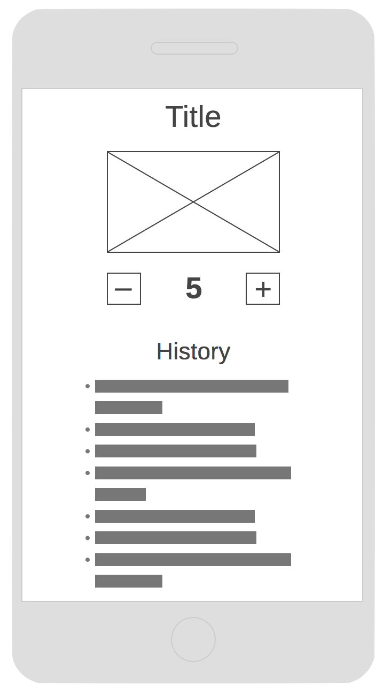

# Counter App

The counter app is the first app we build on the course. It is a one-screen app which is intended to cover the fundamentals of a React Native app.

## Wireframe

The following wireframe should be used as a guide when building the app.

## Requirements

The app should:

- Display a title `'The Count'` and a picture of Count von Count (image files can be found in the [assets](./assets/) folder).
- Render the counter value and controls:
  - The counter value should be flanked on either side by an increment and decrement button.
  - The increment button should add one to the counter value when pressed.
  - The decrement button should subtract one from the counter value when pressed.
  - The counter value should only display a value from 0 - 10.
  - If the counter value is at its lower or upper bound, the respective button should be disabled, so the value cannot exceed its bounds.
- Every time the counter is incremented or decremented, the operation should be added to a history list:
  - Each history item in the list should display:
    - the time when the operation occurred
    - the type of operation (Increment/Decrement)
    - the counter values before & after the operation.
  - The most recent operation should be shown at the top of the history list.
  - If the history list becomes longer than its container, it should be scrollable.
- The headings and buttons should be styled using the primary theme colour `#5a2961`.

## Extras

These requirements are not part of the core project, but can be implemented as enhancements.

- A button should be present to reset the counter value.
- A button should be present to reset the history list.
- When the app is restarted, it should remember the previous counter value, and all history. To persist data between app reloads, you can use the `[AsyncStorage](https://facebook.github.io/react-native/docs/asyncstorage)` module:
  - Import it from React Native in the same way as for other RN components
  - Use `AsyncStorage.setItem(key, value)` to put a _string_ into the storage
  - Use `AsyncStorage.getItem(key)` to pull it out again
  - You'll need to figure out the best time to _set_ and _get_ your app's state so that it will persist between app reloads.
  - (Hint: you'll need to use `[JSON.parse()](https://developer.mozilla.org/en-US/docs/Web/JavaScript/Reference/Global_Objects/JSON/parse)` and `[JSON.stringify()](https://developer.mozilla.org/en-US/docs/Web/JavaScript/Reference/Global_Objects/JSON/stringify)` to convert your app's state from an object to a string, and vice versa - AsyncStorage can only store strings)

## Completed app

The completed app should resemble the following:

The source code for the completed app can be found [here](https://github.com/studiozeffa/counter-app).
