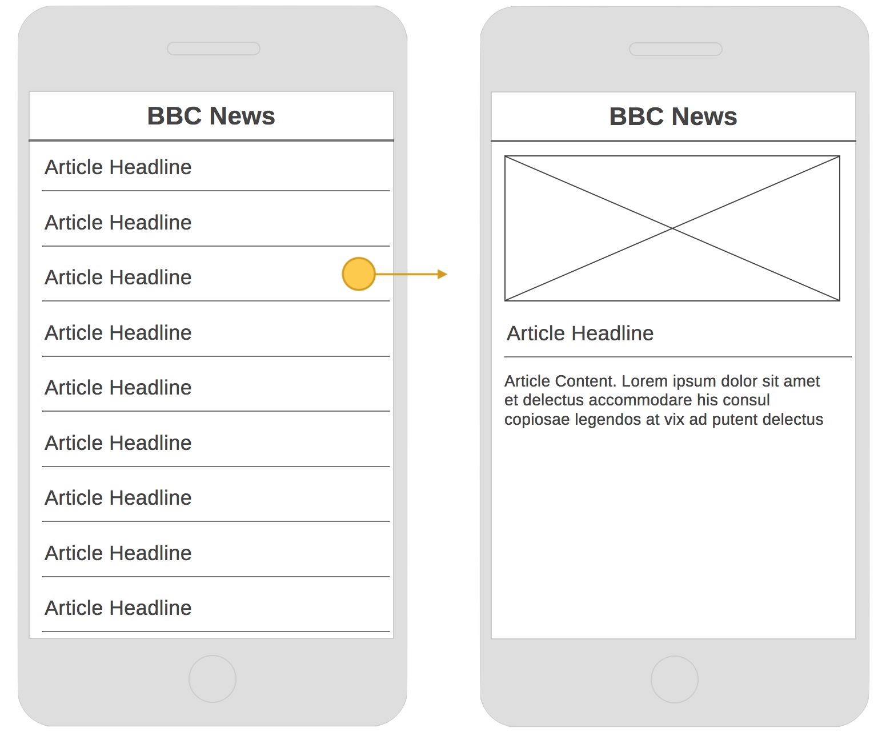
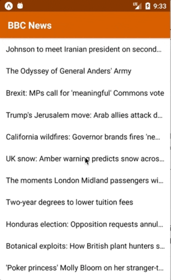

# Films Guide App

The films guide app is the third app we build on the course. It is intended as an informal assessment to test your React Native knowledge gained over the week.

## Wireframe

The following wireframe should be used as a guide when building the app.

## Requirements

The app should:

- Begin with a list screen, displaying a list of article headlines. The articles will be sourced from a local JSON file.
- Allow an article item to be tapped in the list, navigating to a detail view. This will display the following content:
  - Article image (if available)
  - Article headline
  - Article content
- Render the headerbar using a background colour of `#d35400`, with white text.

## Completed app

The completed app should resemble the following.

**iPhone**

**Android**

## Articles data

The articles data can be [found at this link](assets/articles.json). Use this json file in your app to render out the list of headlines.

## Tips

- Scaffold the app with `create-react-native-app`.
- Begin by setting up React Navigation to navigate from one screen to another. Use a `StackNavigator` to achieve this.
- Continue by creating the List Screen.
- Finish with the Detail Screen.
- Remember to split out your container 'screens' from your presentation 'components'.

## Extras

If you manage to finish all of the above, you can find extra work [here](extras.md).
