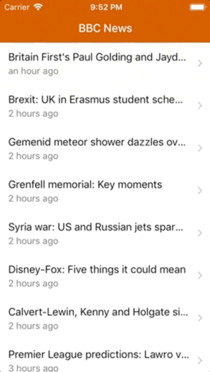
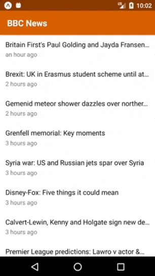

# News Feed App: Additional Functionality

These requirements are not part of the core assignment, but can be implemented as enhancements.

- The detail screen should include a button which, when tapped, will open an in-app-browser screen at the specified article's URL. Use the Expo SDK [WebBrowser](https://docs.expo.io/versions/latest/sdk/webbrowser.html) module to achieve this.
- Change the Back button to read 'Back' on the detail page instead of 'BBC News'. Hint: refer to the [React Navigation docs](https://reactnavigation.org/docs/navigators/stack) and [this issue](https://github.com/react-community/react-navigation/issues/1358).
- Convert the app to store the articles inside a Redux store.
- Read the articles from an API instead of a local JSON file:
  - The API we will be using is https://newsapi.org/
  - To access the API, you need to [register for an API key](https://newsapi.org/register)
  - The API endpoint we will use is https://newsapi.org/v2/everything?sources=bbc-news&language=en&apiKey={API_KEY}. You will need to replace `{API_KEY}` with the API key you received when registering with the service.
- Show a loading spinner while the articles are loading.
- Display the article publication date beneath the headline in both the list and detail view. The date should take the form `X {mins|hours|days} ago`. Hint: use the [momentjs `fromNow()` function](https://momentjs.com/docs/#/displaying/fromnow/) to achieve this.
- Show an accessory 'chevron' to the right of the content inside each list item, for iOS devices only.

The completed app with these extras should resemble the following:

**iPhone**

**Android**

