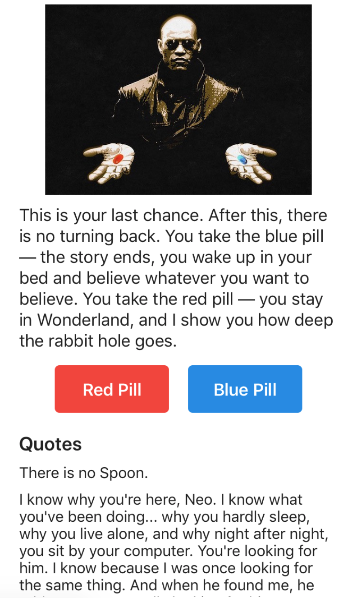

# React Native Components: Challenges

> Tip: start a new app with `expo init` to complete these challenges.

- Modify the scaffolded `App.js` file so that the text is aligned to the top left of the screen (hint: `App.js` contains flexbox styles to center the text, this needs to be undone). Give the container a padding of 20, which will stop the text from overlapping the statusbar at the top of the screen.
- Download the three _morpheus_ images from the [assets folder](assets/) to your computer. Create an `Image` inside your container which should display the image, replacing the existing text. Ensure it is horizontally centred and has a vertical margin of 5.
- Below the image, add some `Text`: _This is your last chance. After this, there is no turning back. You take the blue pill — the story ends, you wake up in your bed and believe whatever you want to believe. You take the red pill — you stay in Wonderland, and I show you how deep the rabbit hole goes._.
  - The `Text` should be horizontally centred, have a vertical margin of 5, size of 18, line height of 22 and a colour of #222222.
- Below the text, render two `TouchableHighlight` buttons, side by side (tip: use a containing `View` and the `flexDirection` style to lay them out side by side).
  - Each button should be 120 wide and 50 high, have a margin of 5 and a border radius of 5.
  - The first button should have a white coloured label _Red Pill_ and should have a background colour of #F44336.
  - The second button should have a white coloured label _Blue Pill_ and should have a background colour of #1E88E5.
  - Each label should be vertically centred inside the button, have a fontSize of 18 and should be bold.
- Render out a list of quotes:
  - Grab [this quotes JSON file](assets/quotes.json) and put it in the project directory. Use `import` to import the JSON into your app.
  - Below the buttons, add a `ScrollView` which takes up the remainder of the screen (hint: use `flex: 1` to fill available space). Give the scroll view a top margin of 5.
  - Inside the `ScrollView`, add a `Text` component with the text _Quotes_. This should be of size 20, bold, have a vertical margin of 5 and have a colour of #222222.
  - Beneath _Quotes_, render each quote from the JSON file. Each quote should have a vertical margin of 5, font size of 16, line height of 18 and a colour of #222222. (Hint: use the `.map()` method to iterate over the quotes array).

  When you have finished, your app should resemble the following:

## Extras

- Create a `Button` component, to be used for the two buttons. Ensure it accepts a background colour, underlay colour, title text and `onPress` handler as props.
- If one of the buttons is pressed five times in a row, disable that button, until the other button is pressed. A disabled button should be styled in a dark grey and should not respond to taps. (Hint: use `state` to track the button presses, and check out the `disabled` prop of `TouchableHighlight`).

> Note: React Native does not support using `.jsx` as a file extension. Use `.js` for your custom components instead.

- Remove the existing text underneath the image. Inside the ScrollView, above the Quotes, create a new history section with the heading _History_.
- Each time one of the buttons is pressed, add a new history item to the top of the _History_ list. Each item in the list should read _You chose the {red|blue} pill!_, depending on the pill that was chosen. (Hint: you'll need to use `state` to track the history of chosen pills))
- Modify the app to use `Redux` instead of `state`:
  - Install and import `redux` and `react-redux`
  - Create a store, a reducer and two actions (one for adding a history item, the other to track the button presses)
  - Implement the reducer to add a history item / track the button pressed as appropriate
  - Remove `state` from the component and use `mapStateToProps`/`mapDispatchToProps` instead