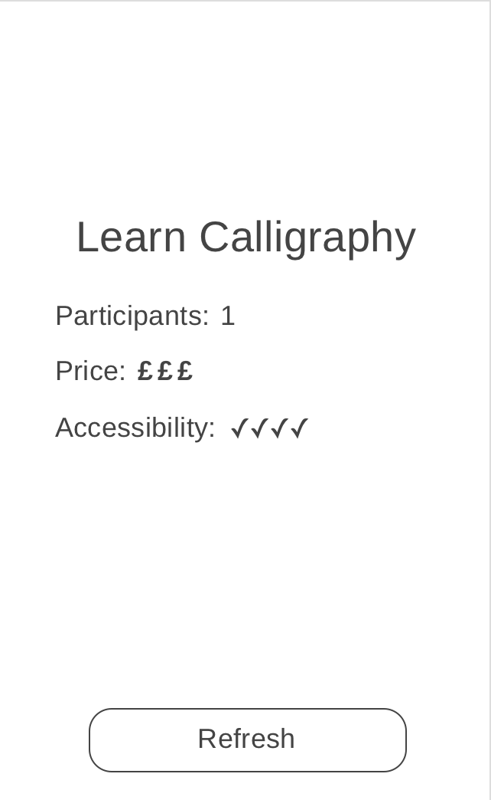

# Async Data Fetching: Challenges

We're going to be using a remote API to fetch data and display it for consumption in an app. You can refer to the [API documentation](https://www.boredapi.com) if you need any further information on the API.

> Tip: start a new app with `expo init` to complete these challenges.

- When the app first loads, fetch some data from the URL `https://www.boredapi.com/api/activity`. Use axios to fetch the data, and think about where this code should be placed in the app so that it is run on app load.
  - Axios will provide a `response` object when the promise is fulfilled, containing a `data` object.
  - The data object will resemble the following:

``` json
{
  "activity": "Learn Express.js",
  "accessibility": 0.25,
  "type": "education",
  "participants": 1,
  "price": 0.1,
  "link": "https://expressjs.com/",
  "key": "3943506"
}
```
- Replace the placeholder text in the app with the activity text from the API. (Hint: you'll need to store the activity text inside React state. Remember that whenever `setState` is called, the component will be re-rendered).

> You should now see a new random activity displayed each time the app is loaded.

- Create a button with the title 'Refresh' and anchor it to the bottom of the screen (hint: use flexbox to lay out the button and activity text container view).
- When the Refresh button is pressed, fetch a new activity from the API and replace the text shown in the app with the new activity.

When finished, the app should resemble this wireframe:


## Extras

- Display a 'Loading' indicator while the data is being fetched (hint: use a boolean flag in the state to track whether data is being fetched or not, and set/unset this flag as appropriate). You may want to use an [`ActivityIndicator`](https://facebook.github.io/react-native/docs/activityindicator) here.
- Display the number of participants required for the activity.
- Display up to 5 [Expo vector icons](https://github.com/expo/vector-icons) for the activity price:

| Price      | Number of icons |
|------------|-----------------|
| 0          | 0               |
| >0 - 0.2   | 1               |
| >0.2 - 0.4 | 2               |
| >0.4 - 0.6 | 3               |
| >0.6 - 0.8 | 4               |
| >0.8       | 5               |

- Display up to 5 [Expo vector icons](https://github.com/expo/vector-icons) for the activity accessibility:

| Accessibility | Number of icons |
|---------------|-----------------|
| 0             | 5               |
| >0 - 0.25     | 4               |
| >0.25 - 0.5   | 3               |
| >0.5 - 0.75   | 2               |
| >0.75         | 1               |

- If the response contains a `link`, display the URL. When pressed, open the [Expo WebBrowser](https://docs.expo.io/versions/latest/sdk/webbrowser/) with this URL.

When finished, the app should resemble this wireframe:



## Further Extras

- Add a second button with the title 'Filter', situated below the Refresh button.
- When pressed, reveal a 'filter' screen (hint: use React local state to keep track of which screen needs to be displayed, and render either the main or filter screen as appropriate).
- The filter screen should offer 'stepper' components to set the minimum/maximum price and accessibility when asking for a random activity. The same icon strategy as listed above should be used:
  - press the `+` button on the stepper: add one icon
  - press the `-` button: remove one icon
- The filter screen should have a 'Save' button, which when pressed should return the user to the main activity screen.
- Each subsequent data fetch should use the saved filter data, adding a query string parameter for each.

For example, if the filter screen is configured as so:

- Minimum Accessibility: 2 icons
- Maximum Accessibility: 5 icons
- Minimum Price: 0 icons
- Maximum Price: 3 icons

The API request should resemble: `https://www.boredapi.com/api/activity?minprice=0&maxprice=0.6&minaccessibility=0.0&maxaccessibility=0.75`
